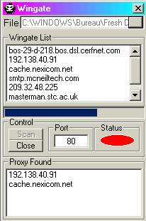



## Wingate

### Description

Scan Wingate! For scanning a file with 100z proxy/wingate/ip to see if they are working.

Are you really able to make this better?

Make this program betterif you can!

and be nice SEND me a copie

OR post'it back to PSC

LOVE YOU ALL Vicky
 
### More Info
 

             |
---                |---
**Submitted On**   |2001-08-03 23:47:58
**By**             |[mini](https://github.com/Planet-Source-Code/PSCIndex/blob/master/ByAuthor/mini.md)
**Level**          |Intermediate
**User Rating**    |4.1 (29 globes from 7 users)
**Compatibility**  |VB 6\.0
**Category**       |[Internet/ HTML](https://github.com/Planet-Source-Code/PSCIndex/blob/master/ByCategory/internet-html__1-34.md)
**World**          |[Visual Basic](https://github.com/Planet-Source-Code/PSCIndex/blob/master/ByWorld/visual-basic.md)
**Archive File**   |[Wingate24055832001\.zip](https://github.com/Planet-Source-Code/mini-wingate__1-25840/archive/master.zip)

